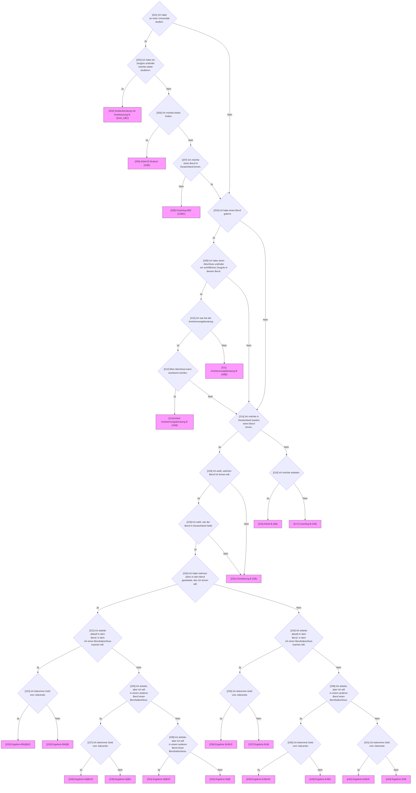

# Aufenthaltserlaubnis

```mermaid
graph TD
  id201{"[201] Ich habe<br>an einer Universität<br>studiert."}
  id202{"[202] Ich habe ein<br>Zeugnis und/oder<br>möchte weiter<br>studieren."}
  id203{"[203] Ich habe einen Beruf gelernt."}
  id204["[204] Studienberatung mit Anerkennung B (SmA_ABC)"]
  id205{"[205] Ich möchte Arbeit finden."}
  id206["[206] Arbeit B Studium (ASB)"]
  id207{"[207] Ich möchte<br>einen Beruf in<br>Deutschland lernen."}
  id208["[208] Coaching ABC (CABC)"]
  id209{"[209] Ich habe einen<br>Abschluss und/oder<br>ein schriftliches Zeugnis in<br>diesem Beruf."}
  id210{"[210] Ich war bei der Anerkennungsberatung."}
  id211["[211] Anerkennungsberatung B (ABB)"]
  id212{"[212] Mein Abschluss kann anerkannt werden."}
  id213["[213] Arbeit Anerkennungsberatung B (AAB)"]
  id214{"[214] Ich möchte in<br>Deutschland (weiter)<br>einen Beruf<br>lernen."}
  id215{"[215] Ich möchte arbeiten."}
  id216["[216] Arbeit B (AB)"]
  id217["[217] Coaching B (CB)"]
  id218{"[218] Ich weiß, welchen Beruf ich lernen will."}
  id219{"[219] Ich weiß, wie der Beruf in Deutschland heißt."}
  id220{"[220] Ich habe mehrere Jahre in dem Beruf gearbeitet, den ich lernen will."}
  id221{"[221] Ich arbeite<br>aktuell in dem<br>Beruf, in dem<br>ich einen Berufsabschluss<br>machen will."}
  id222{"[222] Ich bekomme Geld vom Jobcenter."}
  id225["[225] Ergebnis BNQBJC"]
  id233["[233] Ergebnis BNQB"]
  id223["[223] Orientierung B (OB)"]
  id234{"[234] Ich arbeite<br>aktuell in dem<br>Beruf, in dem<br>ich einen Berufsabschluss<br>machen will."}
  id238{"[238] Ich arbeite,<br>aber ich will<br>in einem anderen<br>Beruf einen<br>Berufsabschluss."}
  id241{"[241] Ich bekomme Geld vom Jobcenter."}
  id244["[244] Ergebnis EAB"]
  id242["[242] Ergebnis EABJC"]
  id227{"[227] Ich bekomme Geld vom Jobcenter."}
  id229["[229] Ergebnis NQBJJC"]
  id230["[230] Ergebnis NQBJ"]
  id228{"[228] Ich bekomme Geld vom Jobcenter."}
  id231["[231] Ergebnis NQBJC"]
  id232["[232] Ergebnis NQB"]
  id235{"[235] Ich bekomme Geld vom Jobcenter."}
  id236["[236] Ergebnis BUBJC"]
  id237["[237] Ergebnis BUB"]
  id239{"[239] Ich bekomme Geld vom Jobcenter."}
  id240["[240] Ergebnis EABJJC"]
  id243["[243] Ergebnis EABJ"]
  id226{"[226] Ich arbeite,<br>aber ich will<br>in einem anderen<br>Beruf einen<br>Berufsabschluss."}
  id228{"[228] Ich arbeite,<br>aber ich will<br>in einem anderen<br>Beruf einen<br>Berufsabschluss."}


  id201-- Ja -->id202
  id201-- Nein -->id203
  id202-- Ja --> id204
  id202-- Nein -->id205
  id205-- Ja -->id206
  id205-- Nein -->id207
  id207-- Nein -->id208
  id207-- Ja -->id203
  id203-- Ja -->id209
  id203-- Nein -->id214
  id209-- Ja -->id210
  id209-- Nein -->id214
  id210-- Ja -->id212
  id210-- Nein -->id211
  id212-- Ja -->id213
  id212-- Nein -->id214
  id214-- Ja -->id218
  id214-- Nein -->id215
  id215-- Ja -->id216
  id215-- Nein -->id217
  id218-- Ja -->id219
  id218-- Nein -->id223
  id219-- Ja -->id220
  id219-- Nein -->id223
  id220-- Ja -->id221
  id220-- Nein -->id234
  id221-- Ja -->id222
  id221-- Nein -->id226
  id222-- Ja -->id225
  id222-- Nein -->id233
  id226-- Ja -->id227
  id226-- Nein -->id228
  id227-- Ja -->id229
  id227-- Nein -->id230
  id228-- Ja -->id231
  id228-- Nein -->id232
  id234-- Ja -->id235
  id234-- Nein -->id238
  id235-- Ja -->id236
  id235-- Nein -->id237
  id238-- Ja -->id239
  id238-- Nein -->id241
  id239-- Ja -->id240
  id239-- Nein -->id243
  id241-- Ja -->id242
  id241-- Nein -->id244


  click id204 "SmA_ABC.html"
  click id206 "ASB.html"
  click id208 "CABC.html"
  click id211 "ABB.html"
  click id213 "AAB.html"
  click id216 "AB.html"
  click id217 "CB.html"
  click id223 "OB.html"
  click id225 "BNQBJC.html"
  click id229 "NQBJJC.html"
  click id230 "NQBJ.html"
  click id231 "NQBJC.html"
  click id232 "NQB.html"
  click id233 "BNQB.html"
  click id236 "BUBJC.html"
  click id237 "BUB.html"
  click id240 "EABJJC.html"
  click id242 "EABJC.html"
  click id243 "EABJ.html"
  click id244 "EAB.html"


  classDef result fill:#f9f,stroke:#333,stroke-width:1px,text-align:center;

  class id204,id206,id208,id211,id213,id216,id217,id223,id225,id229,id230,id231,id232,id233,id236,id237,id240,id243,id242,id244 result;
```
