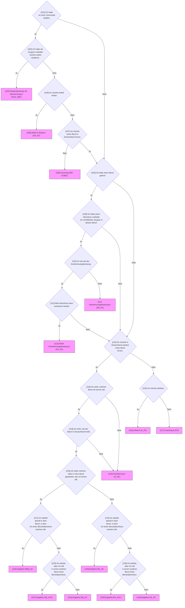

# Aufenthaltsgestattung

```mermaid
graph TD
  id101{"[101] Ich habe<br>an einer Universität<br>studiert."}
  id102{"[102] Ich habe ein<br>Zeugnis und/oder<br>möchte weiter<br>studieren."}
  id103{"[103] Ich habe einen Beruf gelernt."}
  id104["[104] Studienberatung mit Anerkennung A (SmA_ABC)"]
  id105{"[105] Ich möchte Arbeit finden."}
  id106["[106] Arbeit A Studium (AS_AC)"]
  id107{"[107] Ich möchte<br>einen Beruf in<br>Deutschland lernen."}
  id108["[108] Coaching ABC (CABC)."]
  id109{"[109] Ich habe einen<br>Abschluss und/oder<br>ein schriftliches Zeugnis in<br>diesem Beruf."}
  id110{"[110] Ich war bei der Anerkennungsberatung."}
  id111["[111] Anerkennungsberatung A (AB_AC)"]
  id112{"[112] Mein Abschluss kann anerkannt werden."}
  id113["[113] Arbeit Anerkennungsberatung A (AA_AC)"]
  id114{"[114] Ich möchte in<br>Deutschland (weiter)<br>einen Beruf<br>lernen."}
  id115{"[115] Ich möchte arbeiten."}
  id116["[116] Arbeit A (A_AC)"]
  id117["[117] Coaching A (CA)"]
  id118{"[118] Ich weiß, welchen Beruf ich lernen will."}
  id119{"[119] Ich weiß, wie der Beruf in Deutschland heißt."}
  id120{"[120] Ich habe mehrere Jahre in dem Beruf gearbeitet, den ich lernen will."}
  id121{"[121] Ich arbeite<br>aktuell in dem<br>Beruf, in dem<br>ich einen Berufsabschluss<br>machen will."}
  id122["[122] Ergebnis BNQ_AC"]
  id123["[123] Orientierung A (O_AC)"]
  id124{"[124] Ich arbeite<br>aktuell in dem<br>Beruf, in dem<br>ich einen Berufsabschluss<br>machen will."}
  id125["[125] Ergebnis BU_AC"]
  id126{"[126] Ich arbeite,<br>aber ich will<br>in einem anderen<br>Beruf einen<br>Berufsabschluss."}
  id127["[127] Ergebnis NQ_AJCJ"] 
  id128{"[128] Ich arbeite,<br>aber ich will<br>in einem anderen<br>Beruf einen<br>Berufsabschluss."}
  id129["[129] Ergebnis EA_AC"]
  id130["[130] Ergebnis EA_AJCJ"]
  id131["[131] Ergebnis NQ_AC"]


  id101-- Ja -->id102
  id101-- Nein -->id103
  id102-- Ja --> id104
  id102-- Nein -->id105
  id105-- Ja -->id106
  id105-- Nein -->id107
  id107-- Nein -->id108
  id107-- Ja -->id103
  id103-- Ja -->id109
  id103-- Nein -->id114
  id109-- Ja -->id110
  id109-- Nein -->id114
  id110-- Ja -->id112
  id110-- Nein -->id111
  id112-- Ja -->id113
  id112-- Nein -->id114
  id114-- Ja -->id118
  id114-- Nein -->id115
  id115-- Ja -->id116
  id115-- Nein -->id117
  id118-- Ja -->id119
  id118-- Nein -->id123
  id119-- Ja -->id120
  id119-- Nein -->id123
  id120-- Ja -->id121
  id120-- Nein -->id124
  id121-- Ja -->id122
  id121-- Nein -->id126
  id124-- Ja -->id125
  id124-- Nein -->id128
  id126-- Ja -->id127
  id126-- Nein -->id131
  id128-- Ja -->id130
  id128-- Nein --> id129


  click id104 "SmA_ABC.html"
  click id106 "AS_AC.html"
  click id108 "CABC.html"
  click id111 "AB_AC.html"
  click id113 "AA_AC.html"
  click id116 "A_AC.html"
  click id117 "CA.html"
  click id122 "BNQ_AC.html"
  click id123 "O_AC.html"
  click id125 "BU_AC.html"
  click id127 "NQ_AJCJ.html"
  click id129 "EA_AC.html"
  click id130 "EA_AJCJ.html"
  click id131 "NQ_AC.html"


  classDef result fill:#f9f,stroke:#333,stroke-width:1px,text-align:center;

  class id104,id106,id108,id111,id113,id116,id117,id122,id123,id125,id127,id129,id130,id131 result;
```
