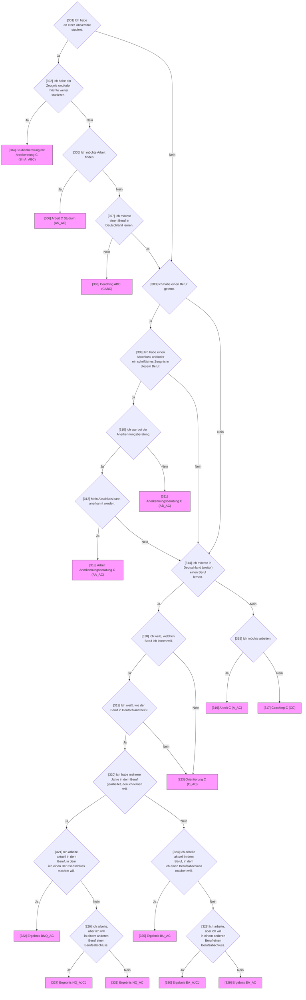

# Duldung

```mermaid
graph TD
  id301{"[301] Ich habe<br>an einer Universität<br>studiert."}
  id302{"[302] Ich habe ein<br>Zeugnis und/oder<br>möchte weiter<br>studieren."}
  id303{"[303] Ich habe einen Beruf gelernt."}
  id304["[304] Studienberatung mit Anerkennung C (SmA_ABC)"]
  id305{"[305] Ich möchte Arbeit finden."}
  id306["[306] Arbeit C Studium (AS_AC)"]
  id307{"[307] Ich möchte<br>einen Beruf in<br>Deutschland lernen."}
  id308["[308] Coaching ABC (CABC)"]
  id309{"[309] Ich habe einen<br>Abschluss und/oder<br>ein schriftliches Zeugnis in<br>diesem Beruf."}
  id310{"[310] Ich war bei der Anerkennungsberatung."}
  id311["[311] Anerkennungsberatung C (AB_AC)"]
  id312{"[312] Mein Abschluss kann anerkannt werden."}
  id313["[313] Arbeit Anerkennungsberatung C (AA_AC)"]
  id314{"[314] Ich möchte in<br>Deutschland (weiter)<br>einen Beruf<br>lernen."}
  id315{"[315] Ich möchte arbeiten."}
  id316["[316] Arbeit C (A_AC)"]
  id317["[317] Coaching C (CC)"]
  id318{"[318] Ich weiß, welchen Beruf ich lernen will."}
  id319{"[319] Ich weiß, wie der Beruf in Deutschland heißt."}
  id320{"[320] Ich habe mehrere Jahre in dem Beruf gearbeitet, den ich lernen will."}
  id321{"[321] Ich arbeite<br>aktuell in dem<br>Beruf, in dem<br>ich einen Berufsabschluss<br>machen will."}
  id322["[322] Ergebnis BNQ_AC"]
  id323["[323] Orientierung C (O_AC)"]
  id324{"[324] Ich arbeite<br>aktuell in dem<br>Beruf, in dem<br>ich einen Berufsabschluss<br>machen will."}
  id325["[325] Ergebnis BU_AC"]
  id326{"[326] Ich arbeite,<br>aber ich will<br>in einem anderen<br>Beruf einen<br>Berufsabschluss."}
  id327["[327] Ergebnis NQ_AJCJ"]
  id328{"[328] Ich arbeite,<br>aber ich will<br>in einem anderen<br>Beruf einen<br>Berufsabschluss."}
  id329["[329] Ergebnis EA_AC"]
  id330["[330] Ergebnis EA_AJCJ"]
  id331["[331] Ergebnis NQ_AC"]


  id301-- Ja -->id302
  id301-- Nein -->id303
  id302-- Ja --> id304
  id302-- Nein -->id305
  id305-- Ja -->id306
  id305-- Nein -->id307
  id307-- Nein -->id308
  id307-- Ja -->id303
  id303-- Ja -->id309
  id303-- Nein -->id314
  id309-- Ja -->id310
  id309-- Nein -->id314
  id310-- Ja -->id312
  id310-- Nein -->id311
  id312-- Ja -->id313
  id312-- Nein -->id314
  id314-- Ja -->id318
  id314-- Nein -->id315
  id315-- Ja -->id316
  id315-- Nein -->id317
  id318-- Ja -->id319
  id318-- Nein -->id323
  id319-- Ja -->id320
  id319-- Nein -->id323
  id320-- Ja -->id321
  id320-- Nein -->id324
  id321-- Ja -->id322
  id321-- Nein -->id326
  id324-- Ja -->id325
  id324-- Nein -->id328
  id326-- Ja -->id327
  id326-- Nein -->id331
  id328-- Ja -->id330
  id328-- Nein --> id329


  click id304 "SmA_ABC.html"
  click id306 "AS_AC.html"
  click id308 "CABC.html"
  click id311 "AB_AC.html"
  click id313 "AA_AC.html"
  click id316 "A_AC.html"
  click id317 "CA.html"
  click id322 "BNQ_AC.html"
  click id323 "O_AC.html"
  click id325 "BU_AC.html"
  click id327 "NQ_AJCJ.html"
  click id329 "EA_AC.html"
  click id330 "EA_AJCJ.html"
  click id331 "NQ_AC.html"


  classDef result fill:#f9f,stroke:#333,stroke-width:1px,text-align:center;

  class id304,id306,id308,id311,id313,id316,id317,id322,id323,id325,id327,id329,id330,id331 result;
```
